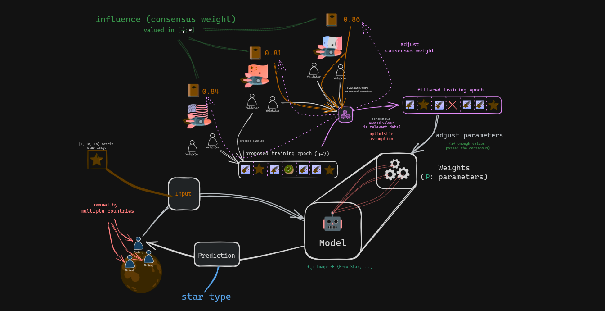

# Astral-ZK-ML

Sponsorized by ETH Bruxelles Contest ⚡️

Decentralized Machine Learning Protocol adapted to both terrestrial and spatial context. 
The models and the two smartcontracts utilizing it are written in the ZK-Proovable language Cairo.

## Introduction

- ✅ **ZK-ML tools** : Built in Cairo for contracts on starknet-compatible blockchain
	- Implemented
		- Multi Layer Perceptron (ie. regular Neural Network)
			- eg: Star type identification
	- Not Implemented Yet
		- Convolutional Neural Network
			- eg: Crater identification
		- Graph Attention Network
			- eg: Constellation identification
- ✅ **Decentralized Smart Contracts** : Variants of the smart contract :
	- **Fully Decentralized**
		- 

		- Based on financial incentive (ie. egoistic incentive)
		- Terestrial variant adapted to Starknet L2.
	- **Country Wise Decentralized**
		- 

		- Assumed resistance to Byzantine fault
		- Spacial variant adapted to a specific L3 for a planet/satellite owned by multiples countries.
- ✅ **Demonstration Client**
    - TODO

## Documentation

- ### [Demonstration Client](client/README.md)
- ### [On Chain content](contract/README.md) 
    - ZK-ML tools 
    - Fully Decentralized contract
    - Country Wise Decentralized contract
- ### [Mathematical/Implementation details](documentation/README.md)
    - Mathematical model/assumptions
    - Algorithms
    - Misc