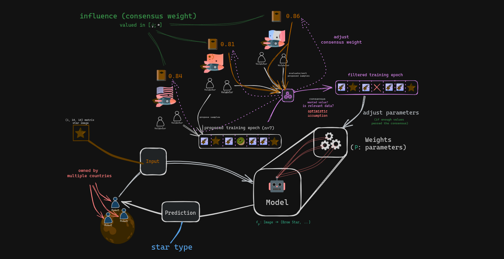
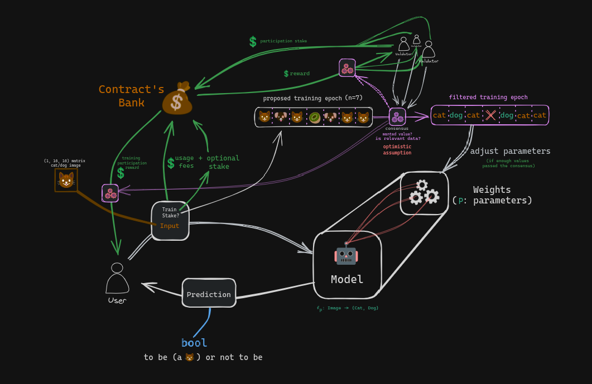

# Documentation

## Summary

- [SmartContracts](#smartcontracts)
    - [Country-Wise Decentralized](#country-wise-decentralized)
    - [Fully Decentralized](#fully-decentralized)
- [Tools](#tools)
    - [Linear Algebra](#linear-algebra)
        - WFloat
        - Vector
        - Matrix
    - [Machine Learning](#machine-learning)
        - MLP
        - CNN
        - GAT
- [Miscellaneous](#miscellaneous)
    - Political questions

## SmartContracts

### Country-Wise Decentralized

We assume that regular users are robots owned by multiple countries. \
Those countries doesn't want to trust other countries to maintain the algorithms of the robots. \
This contract is a proof of concept in the case where the algorithms are machine learning models.

User can call the model to do predictions.

The number of country can increase, if most of the countries agree on the new country.

Each country posseses a list of validators and a level of influence. \
Inside a country, most of the validators are assumed loyal. \
They doesn't want to degrade the influence level of their country.

Each validator can propose sample for the learning process.

The proposed sample needs to be validated by most validators. \
The weight of the vote are determined by the influence of validators's countries.

Validators that are too far from the consensus get a penalty on their countries.

Validator can vote inside their country to replace one of the validators.

##### Algorithm

We always maintains two "bags" of of input data.

The proposition array. When this array is full, validators can vote on it. \
When there is enough votes, the array is destroyed and the survivors are \
added to the validated array.

When the validated array has enough data, it launch the training process.

- <p align="center"></p>
		
##### Miscellaneous

This country-wise version is adapted to spatial context. \
Therefore, we assume, a specific Starknet L3 is deployed using madara for the planet (eg: the moon).


### Fully Decentralized

Based on financial incentive, adapted on very large network on earth with a lot of users.
Implemented on Starknet.

- <p align="center"></p>

## Tools Deployed

Tools availible in `contract/src/math` :
```rust
// GENERAL INTERFACE
pub mod algebra;

// BASIC MATH
pub mod signed;
pub mod wfloat;
pub mod function;
pub mod random;

// LINEAR ALGEBRA
pub mod component_lambda;
pub mod vector;
pub mod matrix;

// DATA SCIENCE MODULES
pub mod statistics;
pub mod ml;
```

### Linear Algebra

### Machine Learning

- Personal notes
    - I should replace MSE with CategoricalCrossEntropy if I have time for most examples.
    - I lost half of the Hackathon thinking I introduced a bug (loss at 0.17 is not that high, but I hoped for a better loss considering MSE loss is not very reliable over Categorical predictions), the two used datasets are just hard to exploit
        - Proof: I get the same Loss from Keras and my model from scratch in ``/contract/draft/on_data_2.ipynb``
        - The Sequential in Cairo is a direct translation from the pythonic version in ``/contracts/draft/basic_model_sample.py``
        - Proof of integrity of the cairo version in : ``/contract/tests/test_cw_contract.cairo``

#### MLP

#### CNN

#### GAT

- Personal notes
    - I will not have the time to do this one, but I keep the idea for future projects at University.

## Miscellaneous

🌠 It's 5:10 AM on Sunday, July 14th, at the station for ETHGlobal Brussels, and I'm starting to hear the whispers from Cairo ghosts... 